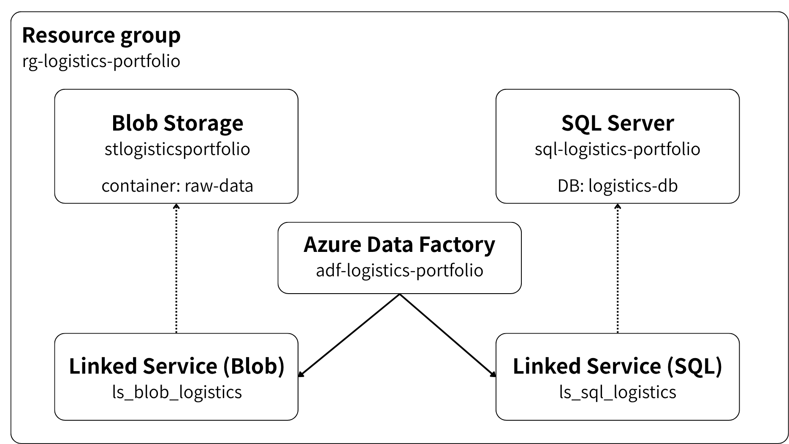
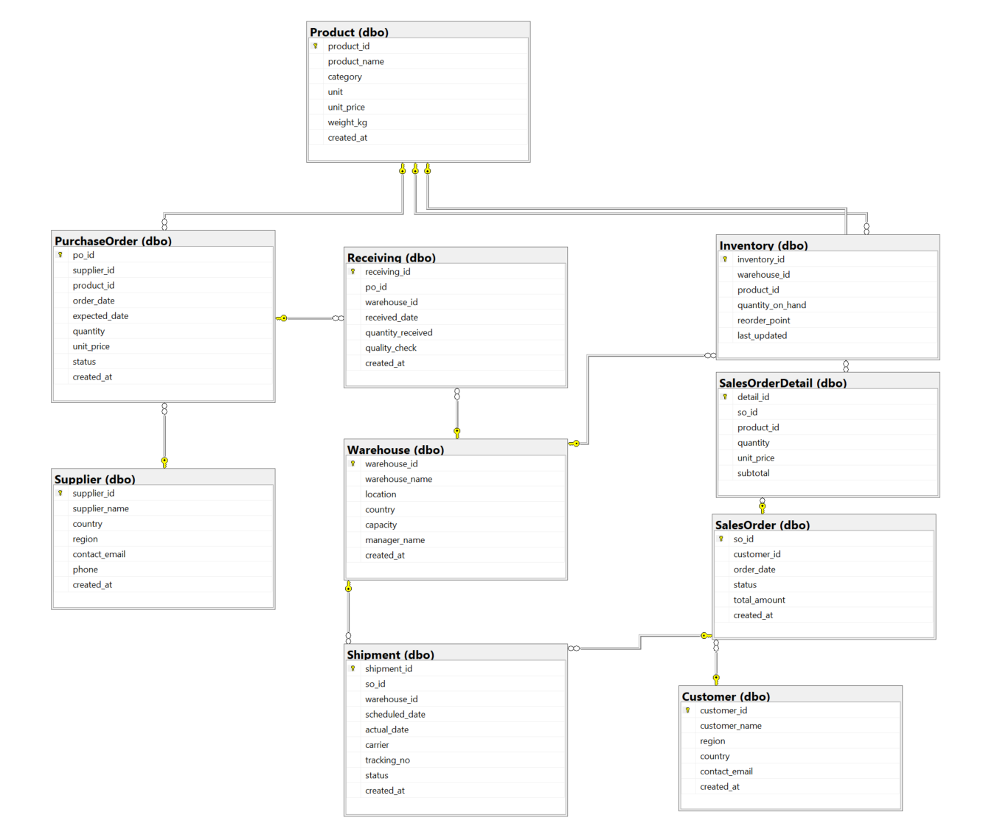

# Logistics Analytics Portfolio

A supply chain and warehouse analytics project built on Microsoft Azure and Power BI.  
This project covers the full data pipeline — from data generation to visualization.

---

## Architecture




| Service | Role |
|---|---|
| Azure Blob Storage | Raw CSV file storage |
| Azure Data Factory | ETL pipeline (CSV → SQL DB) |
| Azure SQL Database | Analytical database |
| Power BI Desktop | Dashboard and reporting |

---

## Tech Stack

- **Cloud**: Microsoft Azure (Blob Storage, Data Factory, SQL Database)
- **Visualization**: Power BI Desktop
- **Language**: Python 3.11, T-SQL
- **Libraries**: faker, pandas, numpy, pyodbc, azure-storage-blob

---

## Database Design



### Tables

| Table | Type | Description |
|---|---|---|
| Supplier | Master | Supplier information |
| Product | Master | Product catalog |
| Warehouse | Master | Warehouse locations |
| Customer | Master | Customer information |
| PurchaseOrder | Transaction | Order records to suppliers |
| Receiving | Transaction | Goods receipt records |
| Inventory | Transaction | Current stock levels |
| SalesOrder | Transaction | Customer order records |
| SalesOrderDetail | Transaction | Order line items |
| Shipment | Transaction | Shipment and delivery records |

---

## Dashboard

Built with Power BI Desktop, connected to Azure SQL Database.

### Pages

| Page | KPI |
|---|---|
| Executive Summary | Overview of all KPIs |
| Inventory Performance | Inventory turnover rate, Stockout rate, ABC analysis |
| Delivery Performance | Lead time, Delay rate, Carrier comparison |
| Procurement Cycle | Order-to-receipt cycle time, On-time delivery rate |
| Warehouse Performance | Warehouse utilization, Shipment count, Delay rate by warehouse |

---

## Sample Data

Generated with Python using the `faker` library.

| Table | Rows |
|---|---|
| Supplier | 30 |
| Product | 80 |
| Warehouse | 6 |
| Customer | 200 |
| PurchaseOrder | 3,000 |
| Receiving | ~2,400 |
| Inventory | ~350 |
| SalesOrder | 8,000 |
| SalesOrderDetail | ~20,000 |
| Shipment | ~7,000 |
| **Total** | **~41,000** |

---

## How to Run

### 1. Generate sample data

```bash
cd python
pip install -r requirements.txt
python generate_data.py
```

### 2. Upload CSV files to Blob Storage

```bash
$env:AZURE_STORAGE_CONNECTION_STRING = "your_connection_string"
python upload_to_blob.py
```

### 3. Run Data Factory pipeline

Trigger the `pl_csv_to_sql` pipeline in Azure Data Factory to load data into SQL Database.

### 4. Insert Shipment data directly

```bash
$env:AZURE_SQL_PASSWORD = "your_password"
python insert_shipment.py
```

### 5. Open Power BI Dashboard

Open `powerbi/logistics_dashboard.pbix` in Power BI Desktop.  
Update the server name in Data Source Settings if needed.

---

## Project Structure

```
logistics-analytics-portfolio/
│
├── README.md
├── sql/
│   └── create_tables.sql        # DDL script for all tables
├── python/
│   ├── generate_data.py         # Sample data generator
│   ├── upload_to_blob.py        # Blob Storage uploader
│   ├── insert_shipment.py       # Shipment data inserter
│   └── requirements.txt         # Python dependencies
├── powerbi/
│   └── logistics_dashboard.pbix # Power BI dashboard
└── docs/
    ├── er_diagram.png            # ER diagram
    └── architecture.png          # Azure architecture diagram
```

---

## Notes

- Sample data is not included in this repository.  
  Run `generate_data.py` to recreate it.
- Azure credentials are managed via environment variables.  
  Never commit passwords or connection strings to the repository.
